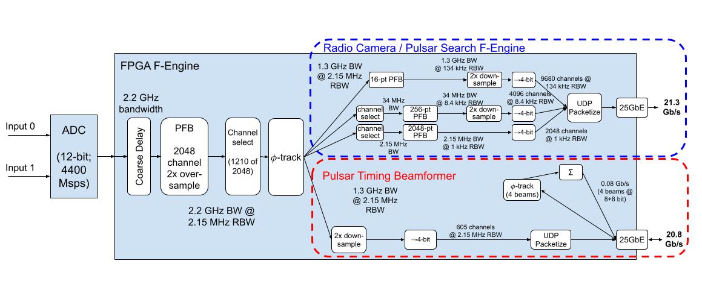
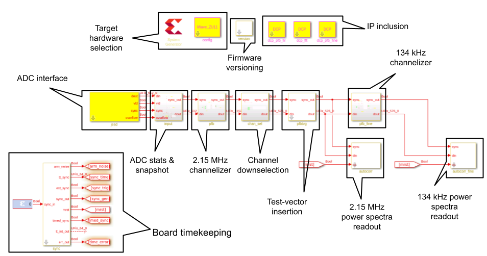

F-Engine System Overview
========================

Overview
--------

The DSA2000 F-Engine firmware receives a stream of ADC samples via a JESD204C interface
and generates the following channelised data products:

 - 9680 channels with ~134 kHz bandwidth, covering the 700-2000MHz band 
 - 4096 channels with ~8.4 kHz bandwidth, with a tunable center frequency.
 - 2048 channels with ~1 kHz bandwidth, with a tunable center frequency.

The firmware also performs beamforming, generating:

 - 4 dual-polarization phased-array beams, covering the 700-2000MHz band with 605 ~2.15 MHz channels

A block diagram of the readout system is shown in :numref:`firmware_block`.

    Top-level F-Engine block diagram

Firmware Source
---------------

Currently, a minimal top-level implementation of the DSA2000 F-engine firmware is available as a Simulink model.

The top-level of this Simulink diagram is shown in :numref:`firmware_top`.
It includes the main high-bandwidth channelizers, and is currently used for resource and power estimations.
This model does not include any of the DSA's high-resolution channelizers, phase-tracking, or beamforming logic.

    Top-level F-Engine top-level firmware

Relevant firmware files are:

 - ``firmware/src/models/dsa2k_iwave_v1.slx`` - Top-level simulink design
 - ``firmware/src/models/dsp/pfb_fir_2p_2kpt_12i_18o_os2_core.slx`` - 2x oversampling PFB FIR frontend
 - ``firmware/src/models/dsp/fft_2p_4kc_18i_18o_core.slx`` - 2.15 MHz channelizer
 - ``firmware/src/models/dsp/pfb_fine_core.slx`` - second stage 134 kHz channelizer

